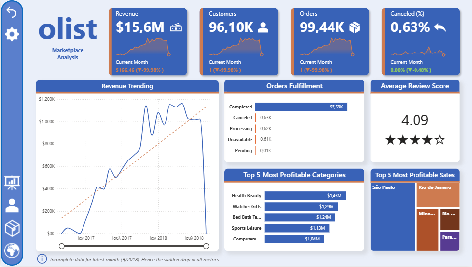

# Interactive Dashboard Using Olist Data in Power BI

An interactive Power BI dashboard analyzing the Olist Brazilian e-commerce dataset to uncover insights on sales performance, customer behavior, product categories, and delivery trends.

## Dataset 

> [!NOTE] 
> This repository uses the data available at [Kaggle](https://www.kaggle.com/datasets/terencicp/e-commerce-dataset-by-olist-as-an-sqlite-database).
